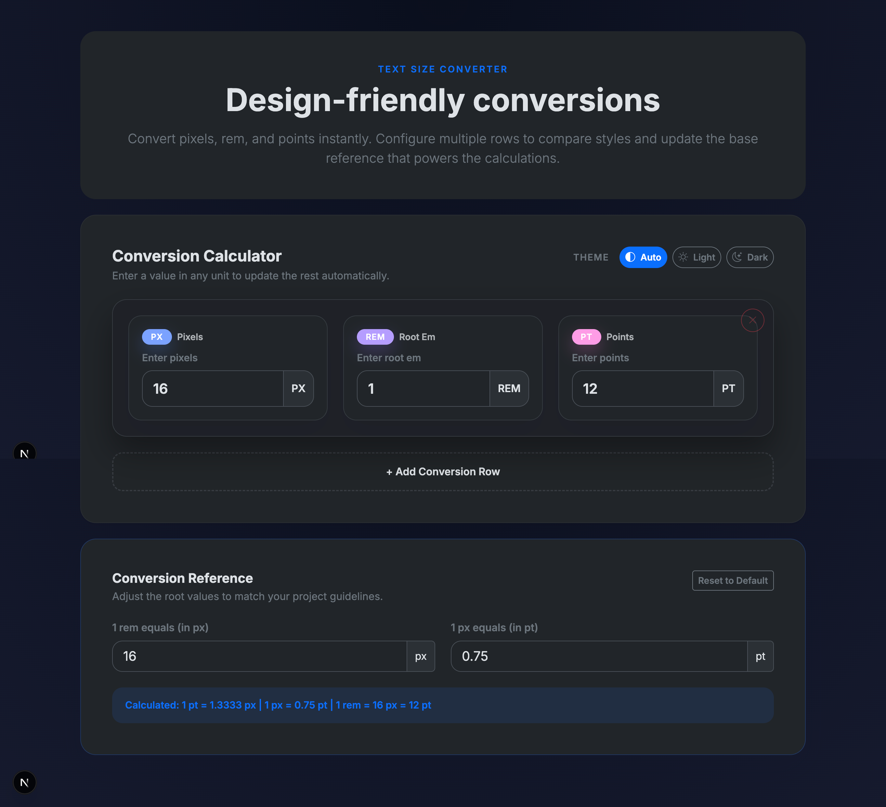
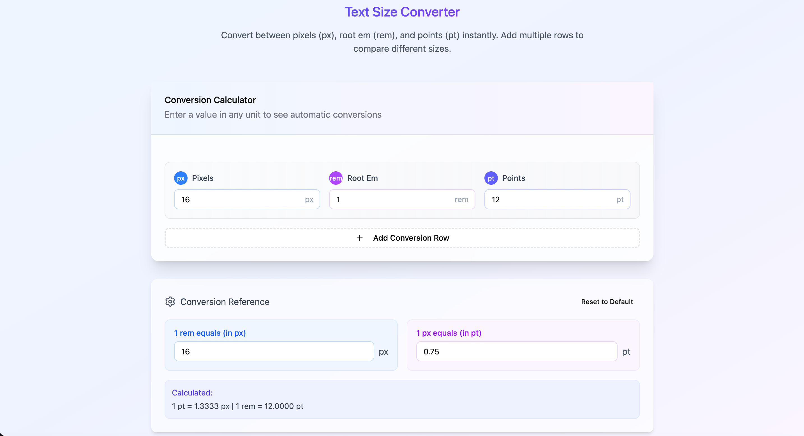

# Text Size Converter 📏

[English](#english) | [中文](#中文) | [Русский](#русский) | [한국어](#한국어) | [Français](#français) | [Deutsch](#deutsch) | [العربية](#العربية) | [Español](#español)

---

## English

### 🎯 Overview

**Text Size Converter** is a modern, responsive web application built with Next.js 16 that enables instant conversion between pixels (px), rem, and points (pt). Perfect for designers and developers who need quick, accurate typography unit conversions with customizable reference values.

### ✨ Features

- 🔄 **Real-time Conversion** - Convert between px, rem, and pt instantly
- 📊 **Multiple Rows** - Add multiple conversion rows to compare different text sizes
- ⚙️ **Customizable References** - Adjust base values for `1rem` and `1px` to match your project
- 🎨 **Theme Support** - Light, dark, and automatic theme modes
- 📱 **Fully Responsive** - Works seamlessly on desktop, tablet, and mobile
- ⚡ **Fast & Lightweight** - Built with Next.js 16 for optimal performance
- 🎭 **Smooth Animations** - Polished UI with smooth transitions

### 🚀 Quick Start

#### Prerequisites

- Node.js 25.0.0 or higher
- npm or yarn

#### Installation

1. Clone the repository:
```bash
git clone https://github.com/neorlover/textsize-converter.git
cd textsize-converter
```

2. Install dependencies:
```bash
npm install
```

3. Run the development server:
```bash
npm run dev
```

4. Open [http://localhost:3000](http://localhost:3000) in your browser

#### Build for Production

```bash
npm run build
npm start
```

### 🛠️ Tech Stack

- **Framework**: Next.js 16.0.0
- **UI Library**: React 18.3.1
- **Styling**: Bootstrap 5.3.3
- **Icons**: Bootstrap Icons 1.11.3
- **Language**: TypeScript 5.6.2

### 📖 Usage

1. **Convert Units**: Enter a value in any field (px, rem, or pt), and the other units will update automatically
2. **Add Rows**: Click "Add Conversion Row" to create multiple conversions for comparison
3. **Adjust References**: Modify the conversion reference values to match your project's design system
4. **Switch Themes**: Toggle between light, dark, and auto themes based on your preference

### 🤝 Contributing

Contributions are welcome! Please feel free to submit a Pull Request. For major changes, please open an issue first to discuss what you would like to change.

1. Fork the project
2. Create your feature branch (`git checkout -b feature/AmazingFeature`)
3. Commit your changes (`git commit -m 'Add some AmazingFeature'`)
4. Push to the branch (`git push origin feature/AmazingFeature`)
5. Open a Pull Request

### 📄 License

This project is open source and available under the [MIT License](LICENSE).

### 🐛 Bug Reports

If you discover a bug, please create an issue on GitHub with detailed information about the problem and steps to reproduce it.

### 💬 Contact

For questions or suggestions, please open an issue on GitHub.

---

## 中文

### 🎯 概述

**Text Size Converter（文本尺寸转换器）**是一个使用 Next.js 16 构建的现代化响应式网页应用，可以在像素（px）、rem 和点（pt）之间进行即时转换。非常适合需要快速、准确的排版单位转换和可自定义参考值的设计师和开发人员。

### ✨ 功能特性

- 🔄 **实时转换** - 在 px、rem 和 pt 之间即时转换
- 📊 **多行对比** - 添加多个转换行以比较不同文本尺寸
- ⚙️ **自定义参考值** - 调整 `1rem` 和 `1px` 的基准值以匹配您的项目
- 🎨 **主题支持** - 明亮、暗黑和自动主题模式
- 📱 **完全响应式** - 在桌面端、平板和移动端无缝运行
- ⚡ **快速轻量** - 使用 Next.js 16 构建，性能优化
- 🎭 **流畅动画** - 精致的 UI 和平滑过渡效果

### 🚀 快速开始

#### 环境要求

- Node.js 25.0.0 或更高版本
- npm 或 yarn

#### 安装步骤

1. 克隆仓库：
```bash
git clone https://github.com/neorlover/textsize-converter.git
cd textsize-converter
```

2. 安装依赖：
```bash
npm install
```

3. 运行开发服务器：
```bash
npm run dev
```

4. 在浏览器中打开 [http://localhost:3000](http://localhost:3000)

#### 生产环境构建

```bash
npm run build
npm start
```

### 🛠️ 技术栈

- **框架**: Next.js 16.0.0
- **UI 库**: React 18.3.1
- **样式**: Bootstrap 5.3.3
- **图标**: Bootstrap Icons 1.11.3
- **语言**: TypeScript 5.6.2

### 📖 使用方法

1. **单位转换**：在任何字段（px、rem 或 pt）中输入值，其他单位会自动更新
2. **添加行**：点击"添加转换行"创建多个转换进行对比
3. **调整参考值**：修改转换参考值以匹配项目的设计系统
4. **切换主题**：根据偏好在明亮、暗黑和自动主题之间切换

### 🤝 贡献

欢迎贡献！请随时提交 Pull Request。对于重大更改，请先开启 issue 讨论您想要更改的内容。

1. Fork 项目
2. 创建功能分支 (`git checkout -b feature/AmazingFeature`)
3. 提交更改 (`git commit -m 'Add some AmazingFeature'`)
4. 推送到分支 (`git push origin feature/AmazingFeature`)
5. 开启 Pull Request

### 📄 许可证

本项目是开源的，使用 [MIT 许可证](LICENSE)。

### 🐛 错误报告

如果您发现错误，请在 GitHub 上创建 issue，并提供有关问题的详细信息和重现步骤。

### 💬 联系方式

如有问题或建议，请在 GitHub 上开启 issue。

---

## Русский

### 🎯 Обзор

**Text Size Converter** — это современное адаптивное веб-приложение, созданное на Next.js 16, которое обеспечивает мгновенное преобразование между пикселями (px), rem и пунктами (pt). Идеально подходит для дизайнеров и разработчиков, которым необходимы быстрые и точные преобразования типографских единиц с настраиваемыми базовыми значениями.

### ✨ Возможности

- 🔄 **Преобразование в реальном времени** - Мгновенное преобразование между px, rem и pt
- 📊 **Несколько строк** - Добавляйте несколько строк преобразования для сравнения разных размеров текста
- ⚙️ **Настраиваемые базовые значения** - Настройте базовые значения для `1rem` и `1px` в соответствии с вашим проектом
- 🎨 **Поддержка тем** - Светлая, темная и автоматическая темы
- 📱 **Полностью адаптивный** - Безупречно работает на настольных компьютерах, планшетах и мобильных устройствах
- ⚡ **Быстрый и легкий** - Создан на Next.js 16 для оптимальной производительности
- 🎭 **Плавные анимации** - Отполированный интерфейс с плавными переходами

### 🚀 Быстрый старт

#### Требования

- Node.js 25.0.0 или выше
- npm или yarn

#### Установка

1. Клонируйте репозиторий:
```bash
git clone https://github.com/neorlover/textsize-converter.git
cd textsize-converter
```

2. Установите зависимости:
```bash
npm install
```

3. Запустите сервер разработки:
```bash
npm run dev
```

4. Откройте [http://localhost:3000](http://localhost:3000) в браузере

#### Сборка для продакшена

```bash
npm run build
npm start
```

### 🛠️ Технологический стек

- **Фреймворк**: Next.js 16.0.0
- **UI библиотека**: React 18.3.1
- **Стилизация**: Bootstrap 5.3.3
- **Иконки**: Bootstrap Icons 1.11.3
- **Язык**: TypeScript 5.6.2

### 📖 Использование

1. **Преобразование единиц**: Введите значение в любое поле (px, rem или pt), и другие единицы обновятся автоматически
2. **Добавить строки**: Нажмите "Добавить строку преобразования" для создания нескольких преобразований для сравнения
3. **Настроить базовые значения**: Измените базовые значения преобразования в соответствии с дизайн-системой вашего проекта
4. **Переключить темы**: Переключайтесь между светлой, темной и автоматической темами в зависимости от ваших предпочтений

### 🤝 Вклад в проект

Приветствуются любые вклады! Пожалуйста, не стесняйтесь отправлять Pull Request. Для крупных изменений, пожалуйста, сначала откройте issue для обсуждения того, что вы хотите изменить.

1. Форкните проект
2. Создайте ветку функции (`git checkout -b feature/AmazingFeature`)
3. Зафиксируйте изменения (`git commit -m 'Add some AmazingFeature'`)
4. Отправьте в ветку (`git push origin feature/AmazingFeature`)
5. Откройте Pull Request

### 📄 Лицензия

Этот проект является открытым исходным кодом и доступен по [лицензии MIT](LICENSE).

### 🐛 Сообщения об ошибках

Если вы обнаружили ошибку, пожалуйста, создайте issue на GitHub с подробной информацией о проблеме и шагами для ее воспроизведения.

### 💬 Контакты

По вопросам или предложениям, пожалуйста, откройте issue на GitHub.

---

## 한국어

### 🎯 개요

**Text Size Converter**는 Next.js 16으로 구축된 현대적이고 반응형 웹 애플리케이션으로, 픽셀(px), rem, 포인트(pt) 간의 즉각적인 변환을 제공합니다. 사용자 정의 가능한 기준값으로 빠르고 정확한 타이포그래피 단위 변환이 필요한 디자이너와 개발자에게 완벽합니다.

### ✨ 기능

- 🔄 **실시간 변환** - px, rem, pt 간 즉시 변환
- 📊 **다중 행** - 여러 변환 행을 추가하여 다양한 텍스트 크기 비교
- ⚙️ **맞춤형 기준값** - 프로젝트에 맞게 `1rem` 및 `1px`의 기본값 조정
- 🎨 **테마 지원** - 라이트, 다크 및 자동 테마 모드
- 📱 **완전한 반응형** - 데스크톱, 태블릿, 모바일에서 원활하게 작동
- ⚡ **빠르고 가벼움** - 최적의 성능을 위해 Next.js 16으로 구축
- 🎭 **부드러운 애니메이션** - 부드러운 전환으로 세련된 UI

### 🚀 빠른 시작

#### 요구사항

- Node.js 25.0.0 이상
- npm 또는 yarn

#### 설치

1. 저장소 클론:
```bash
git clone https://github.com/neorlover/textsize-converter.git
cd textsize-converter
```

2. 종속성 설치:
```bash
npm install
```

3. 개발 서버 실행:
```bash
npm run dev
```

4. 브라우저에서 [http://localhost:3000](http://localhost:3000) 열기

#### 프로덕션 빌드

```bash
npm run build
npm start
```

### 🛠️ 기술 스택

- **프레임워크**: Next.js 16.0.0
- **UI 라이브러리**: React 18.3.1
- **스타일링**: Bootstrap 5.3.3
- **아이콘**: Bootstrap Icons 1.11.3
- **언어**: TypeScript 5.6.2

### 📖 사용법

1. **단위 변환**: 모든 필드(px, rem 또는 pt)에 값을 입력하면 다른 단위가 자동으로 업데이트됩니다
2. **행 추가**: "변환 행 추가"를 클릭하여 비교할 여러 변환 생성
3. **기준값 조정**: 프로젝트의 디자인 시스템에 맞게 변환 기준값 수정
4. **테마 전환**: 선호도에 따라 라이트, 다크 및 자동 테마 간 전환

### 🤝 기여

기여를 환영합니다! Pull Request를 자유롭게 제출해 주세요. 주요 변경 사항의 경우 먼저 issue를 열어 변경하려는 내용을 논의해 주세요.

1. 프로젝트 포크
2. 기능 브랜치 생성 (`git checkout -b feature/AmazingFeature`)
3. 변경 사항 커밋 (`git commit -m 'Add some AmazingFeature'`)
4. 브랜치에 푸시 (`git push origin feature/AmazingFeature`)
5. Pull Request 열기

### 📄 라이센스

이 프로젝트는 오픈 소스이며 [MIT 라이센스](LICENSE)에 따라 사용할 수 있습니다.

### 🐛 버그 보고

버그를 발견하면 문제에 대한 자세한 정보와 재현 단계를 포함하여 GitHub에서 issue를 생성해 주세요.

### 💬 연락처

질문이나 제안 사항이 있으면 GitHub에서 issue를 열어주세요.

---

## Français

### 🎯 Aperçu

**Text Size Converter** est une application web moderne et réactive construite avec Next.js 16 qui permet une conversion instantanée entre les pixels (px), rem et points (pt). Parfait pour les designers et développeurs qui ont besoin de conversions d'unités typographiques rapides et précises avec des valeurs de référence personnalisables.

### ✨ Fonctionnalités

- 🔄 **Conversion en temps réel** - Convertissez instantanément entre px, rem et pt
- 📊 **Lignes multiples** - Ajoutez plusieurs lignes de conversion pour comparer différentes tailles de texte
- ⚙️ **Références personnalisables** - Ajustez les valeurs de base pour `1rem` et `1px` selon votre projet
- 🎨 **Support des thèmes** - Modes de thème clair, sombre et automatique
- 📱 **Entièrement responsive** - Fonctionne parfaitement sur desktop, tablette et mobile
- ⚡ **Rapide et léger** - Construit avec Next.js 16 pour des performances optimales
- 🎭 **Animations fluides** - Interface soignée avec des transitions douces

### 🚀 Démarrage rapide

#### Prérequis

- Node.js 25.0.0 ou supérieur
- npm ou yarn

#### Installation

1. Clonez le dépôt :
```bash
git clone https://github.com/neorlover/textsize-converter.git
cd textsize-converter
```

2. Installez les dépendances :
```bash
npm install
```

3. Lancez le serveur de développement :
```bash
npm run dev
```

4. Ouvrez [http://localhost:3000](http://localhost:3000) dans votre navigateur

#### Build pour la production

```bash
npm run build
npm start
```

### 🛠️ Stack technique

- **Framework**: Next.js 16.0.0
- **Bibliothèque UI**: React 18.3.1
- **Stylisation**: Bootstrap 5.3.3
- **Icônes**: Bootstrap Icons 1.11.3
- **Langage**: TypeScript 5.6.2

### 📖 Utilisation

1. **Convertir les unités** : Entrez une valeur dans n'importe quel champ (px, rem ou pt), et les autres unités se mettront à jour automatiquement
2. **Ajouter des lignes** : Cliquez sur "Ajouter une ligne de conversion" pour créer plusieurs conversions à comparer
3. **Ajuster les références** : Modifiez les valeurs de référence de conversion pour correspondre au système de design de votre projet
4. **Changer de thème** : Basculez entre les thèmes clair, sombre et automatique selon vos préférences

### 🤝 Contribution

Les contributions sont les bienvenues ! N'hésitez pas à soumettre une Pull Request. Pour les changements majeurs, veuillez d'abord ouvrir une issue pour discuter de ce que vous souhaitez modifier.

1. Forkez le projet
2. Créez votre branche de fonctionnalité (`git checkout -b feature/AmazingFeature`)
3. Committez vos changements (`git commit -m 'Add some AmazingFeature'`)
4. Poussez vers la branche (`git push origin feature/AmazingFeature`)
5. Ouvrez une Pull Request

### 📄 Licence

Ce projet est open source et disponible sous la [licence MIT](LICENSE).

### 🐛 Rapports de bugs

Si vous découvrez un bug, veuillez créer une issue sur GitHub avec des informations détaillées sur le problème et les étapes pour le reproduire.

### 💬 Contact

Pour des questions ou suggestions, veuillez ouvrir une issue sur GitHub.

---

## Deutsch

### 🎯 Übersicht

**Text Size Converter** ist eine moderne, responsive Webanwendung, die mit Next.js 16 entwickelt wurde und eine sofortige Konvertierung zwischen Pixeln (px), rem und Punkten (pt) ermöglicht. Perfekt für Designer und Entwickler, die schnelle, präzise Typografie-Einheitenkonvertierungen mit anpassbaren Referenzwerten benötigen.

### ✨ Funktionen

- 🔄 **Echtzeit-Konvertierung** - Sofortige Konvertierung zwischen px, rem und pt
- 📊 **Mehrere Zeilen** - Fügen Sie mehrere Konvertierungszeilen hinzu, um verschiedene Textgrößen zu vergleichen
- ⚙️ **Anpassbare Referenzen** - Passen Sie Basiswerte für `1rem` und `1px` an Ihr Projekt an
- 🎨 **Theme-Unterstützung** - Helle, dunkle und automatische Theme-Modi
- 📱 **Vollständig responsive** - Funktioniert nahtlos auf Desktop, Tablet und Mobilgeräten
- ⚡ **Schnell & leichtgewichtig** - Mit Next.js 16 für optimale Leistung gebaut
- 🎭 **Flüssige Animationen** - Polierte Benutzeroberfläche mit glatten Übergängen

### 🚀 Schnellstart

#### Voraussetzungen

- Node.js 25.0.0 oder höher
- npm oder yarn

#### Installation

1. Repository klonen:
```bash
git clone https://github.com/neorlover/textsize-converter.git
cd textsize-converter
```

2. Abhängigkeiten installieren:
```bash
npm install
```

3. Entwicklungsserver starten:
```bash
npm run dev
```

4. Öffnen Sie [http://localhost:3000](http://localhost:3000) in Ihrem Browser

#### Produktions-Build

```bash
npm run build
npm start
```

### 🛠️ Tech-Stack

- **Framework**: Next.js 16.0.0
- **UI-Bibliothek**: React 18.3.1
- **Styling**: Bootstrap 5.3.3
- **Icons**: Bootstrap Icons 1.11.3
- **Sprache**: TypeScript 5.6.2

### 📖 Verwendung

1. **Einheiten konvertieren**: Geben Sie einen Wert in einem beliebigen Feld (px, rem oder pt) ein, und die anderen Einheiten werden automatisch aktualisiert
2. **Zeilen hinzufügen**: Klicken Sie auf "Konvertierungszeile hinzufügen", um mehrere Konvertierungen zum Vergleich zu erstellen
3. **Referenzen anpassen**: Ändern Sie die Konvertierungsreferenzwerte, um sie an das Designsystem Ihres Projekts anzupassen
4. **Themes wechseln**: Wechseln Sie je nach Präferenz zwischen hellen, dunklen und automatischen Themes

### 🤝 Beiträge

Beiträge sind willkommen! Bitte zögern Sie nicht, einen Pull Request einzureichen. Für größere Änderungen öffnen Sie bitte zuerst ein Issue, um zu besprechen, was Sie ändern möchten.

1. Forken Sie das Projekt
2. Erstellen Sie Ihren Feature-Branch (`git checkout -b feature/AmazingFeature`)
3. Committen Sie Ihre Änderungen (`git commit -m 'Add some AmazingFeature'`)
4. Pushen Sie zum Branch (`git push origin feature/AmazingFeature`)
5. Öffnen Sie einen Pull Request

### 📄 Lizenz

Dieses Projekt ist Open Source und unter der [MIT-Lizenz](LICENSE) verfügbar.

### 🐛 Fehlermeldungen

Wenn Sie einen Fehler entdecken, erstellen Sie bitte ein Issue auf GitHub mit detaillierten Informationen über das Problem und Schritten zur Reproduktion.

### 💬 Kontakt

Bei Fragen oder Vorschlägen öffnen Sie bitte ein Issue auf GitHub.

---

## العربية

### 🎯 نظرة عامة

**محول حجم النص** هو تطبيق ويب حديث ومتجاوب مبني بإستخدام Next.js 16 يتيح التحويل الفوري بين البكسل (px) و rem والنقاط (pt). مثالي للمصممين والمطورين الذين يحتاجون إلى تحويلات سريعة ودقيقة لوحدات الطباعة مع قيم مرجعية قابلة للتخصيص.

### ✨ الميزات

- 🔄 **التحويل في الوقت الفعلي** - التحويل الفوري بين px و rem و pt
- 📊 **صفوف متعددة** - أضف صفوف تحويل متعددة لمقارنة أحجام النصوص المختلفة
- ⚙️ **مراجع قابلة للتخصيص** - اضبط القيم الأساسية لـ `1rem` و `1px` لتتناسب مع مشروعك
- 🎨 **دعم السمات** - أوضاع السمات الفاتحة والداكنة والتلقائية
- 📱 **متجاوب بالكامل** - يعمل بسلاسة على سطح المكتب والأجهزة اللوحية والهواتف المحمولة
- ⚡ **سريع وخفيف** - مبني بإستخدام Next.js 16 للأداء الأمثل
- 🎭 **رسوم متحركة سلسة** - واجهة مستخدم مصقولة مع انتقالات سلسة

### 🚀 البدء السريع

#### المتطلبات

- Node.js 25.0.0 أو أعلى
- npm أو yarn

#### التثبيت

1. استنساخ المستودع:
```bash
git clone https://github.com/neorlover/textsize-converter.git
cd textsize-converter
```

2. تثبيت التبعيات:
```bash
npm install
```

3. تشغيل خادم التطوير:
```bash
npm run dev
```

4. افتح [http://localhost:3000](http://localhost:3000) في متصفحك

#### البناء للإنتاج

```bash
npm run build
npm start
```

### 🛠️ المجموعة التقنية

- **الإطار**: Next.js 16.0.0
- **مكتبة واجهة المستخدم**: React 18.3.1
- **التصميم**: Bootstrap 5.3.3
- **الأيقونات**: Bootstrap Icons 1.11.3
- **اللغة**: TypeScript 5.6.2

### 📖 الاستخدام

1. **تحويل الوحدات**: أدخل قيمة في أي حقل (px أو rem أو pt)، وسيتم تحديث الوحدات الأخرى تلقائيًا
2. **إضافة صفوف**: انقر على "إضافة صف تحويل" لإنشاء تحويلات متعددة للمقارنة
3. **ضبط المراجع**: عدّل قيم مرجع التحويل لتتناسب مع نظام تصميم مشروعك
4. **تبديل السمات**: التبديل بين السمات الفاتحة والداكنة والتلقائية بناءً على تفضيلاتك

### 🤝 المساهمة

المساهمات مرحب بها! لا تتردد في تقديم طلب سحب (Pull Request). بالنسبة للتغييرات الكبيرة، يرجى فتح مشكلة (issue) أولاً لمناقشة ما تريد تغييره.

1. قم بعمل Fork للمشروع
2. أنشئ فرع الميزة الخاص بك (`git checkout -b feature/AmazingFeature`)
3. قم بتنفيذ تغييراتك (`git commit -m 'Add some AmazingFeature'`)
4. ادفع إلى الفرع (`git push origin feature/AmazingFeature`)
5. افتح طلب سحب (Pull Request)

### 📄 الترخيص

هذا المشروع مفتوح المصدر ومتاح بموجب [ترخيص MIT](LICENSE).

### 🐛 تقارير الأخطاء

إذا اكتشفت خطأ، يرجى إنشاء مشكلة (issue) على GitHub مع معلومات مفصلة حول المشكلة وخطوات إعادة إنتاجها.

### 💬 الاتصال

للأسئلة أو الاقتراحات، يرجى فتح مشكلة (issue) على GitHub.

---

## Español

### 🎯 Descripción

**Text Size Converter** es una aplicación web moderna y responsiva construida con Next.js 16 que permite la conversión instantánea entre píxeles (px), rem y puntos (pt). Perfecta para diseñadores y desarrolladores que necesitan conversiones rápidas y precisas de unidades tipográficas con valores de referencia personalizables.

### ✨ Características

- 🔄 **Conversión en tiempo real** - Convierte instantáneamente entre px, rem y pt
- 📊 **Múltiples filas** - Añade múltiples filas de conversión para comparar diferentes tamaños de texto
- ⚙️ **Referencias personalizables** - Ajusta los valores base para `1rem` y `1px` según tu proyecto
- 🎨 **Soporte de temas** - Modos de tema claro, oscuro y automático
- 📱 **Totalmente responsivo** - Funciona perfectamente en escritorio, tableta y móvil
- ⚡ **Rápido y ligero** - Construido con Next.js 16 para un rendimiento óptimo
- 🎭 **Animaciones suaves** - Interfaz pulida con transiciones fluidas

### 🚀 Inicio rápido

#### Requisitos previos

- Node.js 25.0.0 o superior
- npm o yarn

#### Instalación

1. Clonar el repositorio:
```bash
git clone https://github.com/neorlover/textsize-converter.git
cd textsize-converter
```

2. Instalar dependencias:
```bash
npm install
```

3. Ejecutar el servidor de desarrollo:
```bash
npm run dev
```

4. Abrir [http://localhost:3000](http://localhost:3000) en tu navegador

#### Compilación para producción

```bash
npm run build
npm start
```

### 🛠️ Stack tecnológico

- **Framework**: Next.js 16.0.0
- **Librería UI**: React 18.3.1
- **Estilos**: Bootstrap 5.3.3
- **Iconos**: Bootstrap Icons 1.11.3
- **Lenguaje**: TypeScript 5.6.2

### 📖 Uso

1. **Convertir unidades**: Introduce un valor en cualquier campo (px, rem o pt) y las otras unidades se actualizarán automáticamente
2. **Añadir filas**: Haz clic en "Añadir fila de conversión" para crear múltiples conversiones para comparar
3. **Ajustar referencias**: Modifica los valores de referencia de conversión para que coincidan con el sistema de diseño de tu proyecto
4. **Cambiar temas**: Alterna entre temas claro, oscuro y automático según tus preferencias

### 🤝 Contribuir

¡Las contribuciones son bienvenidas! No dudes en enviar un Pull Request. Para cambios importantes, por favor abre primero un issue para discutir lo que te gustaría cambiar.

1. Haz un fork del proyecto
2. Crea tu rama de característica (`git checkout -b feature/AmazingFeature`)
3. Confirma tus cambios (`git commit -m 'Add some AmazingFeature'`)
4. Empuja a la rama (`git push origin feature/AmazingFeature`)
5. Abre un Pull Request

### 📄 Licencia

Este proyecto es de código abierto y está disponible bajo la [Licencia MIT](LICENSE).

### 🐛 Informes de errores

Si descubres un error, por favor crea un issue en GitHub con información detallada sobre el problema y los pasos para reproducirlo.

### 💬 Contacto

Para preguntas o sugerencias, por favor abre un issue en GitHub.

---

## 📸 Screenshots



---

## ⭐ Star History

If you find this project useful, please consider giving it a star on GitHub!

---

Made with ❤️ by the open source community
>>>>>>> 625bca8 (Initial commit)
